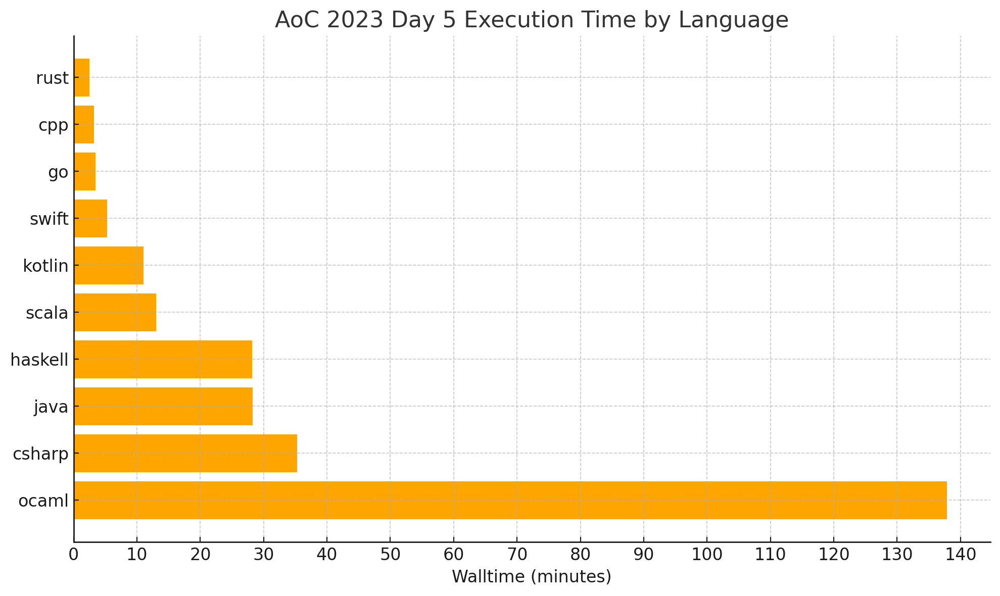

# HOTLangBench (WiP)

[github.com/klaeufer/HOTLangBench](https://github.com/klaeufer/HOTLangBench)

Konstantin Läufer\
Department of Computer Science\
Loyola University Chicago

May 2025

## Abstract

This work in progress aims to compare various HOT (higher-order and statically typed, a term coined by Phil Wadler) through *reproducible* course-grained, wall-time benchmarks.
Our overall goals include simplicity, agility, and reproducibility.

There is currently only one benchmark, but it brings out substantial performance differences among the various languages and platforms. 
It is easy to add versions of this benchmark in other languages (see below).

## Motivation

As a lifelong student of programming languages, especially HOT ones, I have been intrigued by the [Computer Language Benchmarks Game](https://benchmarksgame-team.pages.debian.net/benchmarksgame), a.k.a. the shootout.
Nevertheless, the shootout seems to focus mostly on computational physics problems with few opportunities to use higher-order programming techniques.

Meanwhile, I started to work on some [Advent of Code](https://adventofcode.com) challenges to stay current on my coding skills.
When I worked on [this puzzle](https://adventofcode.com/2023/day/5), I noticed that my Scala version hadn't finished after several hours; because I didn't want my laptop to overheat, I ran it on a fast compute node, where it took about three hours. 
Because I was also getting interested in Rust, I transliterated my code as closely as possible, and the resulting Rust code ran in about three minutes.

As a first step toward understanding the root causes for these major differences, I decided to transliterate the code to various other languages and platforms and compare their relative performance in a coarse-grained manner.
For reproducibility, compared to the complex and Python 2-based scripts included in the shootout, I created my own, very simple shell scripts.

## Related work

Other than the shootout and its forks, we have not found any broadly cross-language benchmarks.

There are some highly comprehensive benchmark suites specifically for the JVM, including https://renaissance.dev and https://www.dacapobench.org, as well as the http://mlton.org/Performance suite for Standard ML.

In addition, there is the https://github.com/ParaGroup/StreamBenchmarks suite, which focuses on the technical domain of several prominent stream processing engines and libraries.

These benchmark suites are potential sources of candidate algorithms for transliteration to a broader set of languages.

## Languages

Currently, the following languages are supported:

- Modern C++
- C#
- Go
- Haskell
- Kotlin
- Modern Java (24)
- OCaml
- Rust
- Scala 3
- Swift

I wrote the Scala version first, using function composition and other higher-order constructs to build a pipeline of transformations, along with a brute-force iteration that is computationally expensive for large seed ranges.

I then manually transliterated the Scala version to Rust, Java, C#, and Kotlin.

Recently, I used Anthropic Claude to transliterate the Scala version to C++, Go, Haskell, OCaml, and Swift, thereby covering most mainstream HOT languages.

Help with missing languages is welcome, including:

- TypeScript
- ...

## Benchmarks

There is currently only one algorithm being benchmarked across the various languages: the seed-fertilizer mapping puzzle from day 5 of the 2023 Advent of Code.

https://adventofcode.com/2023/day/5

### Preliminary results

We ran the benchmarks on a compute server with two AMD EPYC 9354 32-core processors and 1.5 TB of RAM.

| Language | Walltime (hh:mm:ss) |
|----------|---------------------|
| rust     | 00:02:37            |
| cpp      | 00:03:15            |
| go       | 00:03:26            |
| swift    | 00:05:17            |
| kotlin   | 00:11:00            |
| csharp   | 01:09:20            |
| scala    | 02:13:01            |
| ocaml    | 02:17:50            |
| haskell  | 02:48:01            |
| java     | 03:46:34            |

We're currently reviewing the bottom five results to make sure we've enabled the typical optimizations.

### Reproducing the benchmarks

These steps are based on the [GitHub CI workflow](blob/main/.github/workflows/main.yml).

- Use a suitable compute node running Ubuntu or similar Debian-based distribution.
- If you have root access, you should be able to run `scripts/install-prereqs.sh`
- Otherwise you can use Homebrew to install equivalent prerequisites (we are working on an alternative script for this).
- To build the executables, run `scripts/buildall.sh`.
- As a sanity check, run `scripts/runall.sh`.
- Then run the full benchmarks via `scripts/benchmark.sh`; we recommend doing this in a tmux session that you can reattach to if necessary.

### Limitations

- Each benchmark runs only once. Because the benchmarks are coarse-grained and long-running, with substantially difference in running times across languages, this might not be a problem when focusing on major trends. Nevertheless, we are planning to make our process for generating the benchmarks more rigorous by using appropriate tools.
- The algorithm(s) included so far are sequential.
Therefore, they are only partially relevant for performance differences among these languages in real-world scenarios involving concurrent, parallel, or distributed algorithms and implementations.

## Interpretation

Ostensibly, the winners on the performance dimension are  Rust and C++, with Go and Swift being a close third and fourth, respectively, and Kotlin a not-so-distant but all the more surprising fifth.
But when considering factors beyond performance, such as productivity and portability (see also [this paper on P3](https://ieeexplore.ieee.org/document/9484790)), the picture evolves.

- If we argue that Go has a lower learning curve than Rust or C++, then taking a small performance hit in exchage for higher programmer productivity could be worth it.
- If we additionally argue that Kotlin, as a JVM language, has superior portability, then it could be considered the overall winner with respect to P3.

## Future work

It should be relatively easy to add other benchmarks with a minor refactoring of the directory structure.

We also plan to address the limitations listed above.

Furthermore, we should include other performance metrics, especially heap memory usage.
